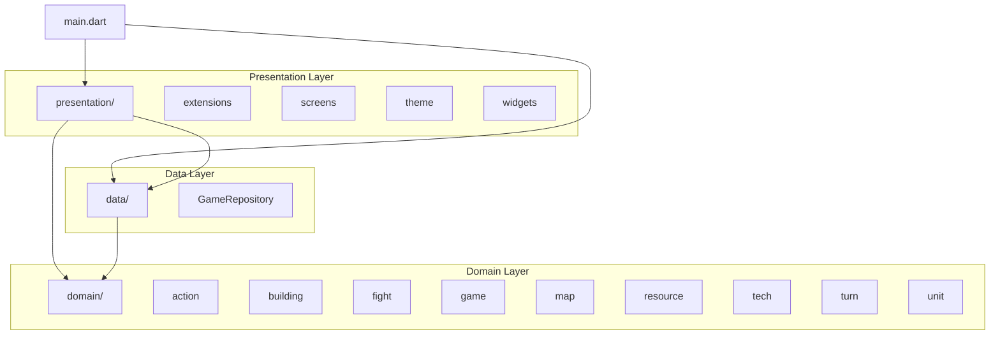
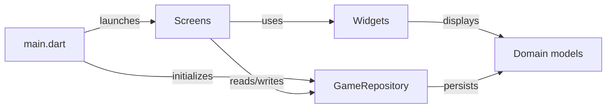

# ABYSSES - Architecture

## Project Overview

ABYSSES is a single-player, turn-based strategy game set in an underwater universe. Inspired by Travian, OGame, and Clash of Clans, it replaces real-time waiting with a "next turn" button. The player develops a submarine base, explores ocean depths, and battles rival AI factions across 50-100 turn sessions.

Built with **Flutter + Dart + Hive**. Targets iOS, Android, and Web.

## 3-Layer Architecture

```
lib/
  main.dart              # App entry point
  data/                  # Layer 1 - Persistence
  domain/                # Layer 2 - Business logic
  presentation/          # Layer 3 - UI
```



## Layer Descriptions

### Data (`lib/data/`)

Persistence layer. Uses **Hive** (via `hive_flutter`) for local storage. Contains `GameRepository` which handles save, load, and delete of `Game` objects.

See: [data/](data/)

### Domain (`lib/domain/`)

Pure Dart business logic with no Flutter dependency. Split into 10 submodules:

| Submodule | Responsibility |
|-----------|---------------|
| `action` | Player actions (operate on `(Game, Player)`) |
| `building` | Building types and state |
| `fight` | Combat resolution engine |
| `game` | `Game` multi-player container + `Player` per-player state |
| `history` | Sealed `HistoryEntry` hierarchy for action logging |
| `map` | Multi-level grid, terrain, transition bases (per-player fog lives on `Player`) |
| `resource` | 5 resource types |
| `tech` | Technology branches |
| `turn` | Turn processing |
| `unit` | Unit types and state |

See: [domain/](domain/)

### Presentation (`lib/presentation/`)

Flutter UI layer. Split into 4 submodules:

| Submodule | Responsibility |
|-----------|---------------|
| `extensions` | Dart extension methods for UI |
| `screens` | Full-page screens (menu, game) |
| `theme` | `AbyssTheme` and visual constants |
| `widgets` | Reusable UI components |

See: [presentation/](presentation/)

## Dependency Flow



`main.dart` initializes `GameRepository` (Hive), then passes it to `MainMenuScreen`. Screens use domain models and call the repository for persistence. Domain has zero dependencies on the other layers.

`Game` is a multi-player container: it holds a `Map<String, Player>` plus the shared `Map<int, GameMap> levels` (one map per depth level), turn counter, and a `GameStatus` tracking whether the game is in progress, won, lost, or in free-play mode. All per-player state (resources, buildings, tech, units per level, pending explorations, revealed cells per level, pending reinforcements) lives on `Player`. Actions and turn resolution iterate per player and read that state from the `Player` argument, not from `Game`.
