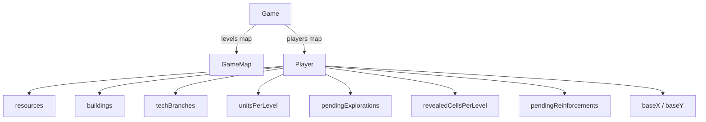

# Game Module

`lib/domain/game/`

This module contains the root game container and the per-player state
aggregate. `Player` owns every piece of state that belongs to a single
participant; `Game` is a thin multi-player container that groups all
players together with the shared map and turn counter.

## Files

| File | Description |
|------|-------------|
| `game.dart` | Root `Game` container |
| `player.dart` | `Player` per-player state aggregate |
| `player_defaults.dart` | Default resources, buildings, tech branches, and units for a new player |

## Game

`Game` is a thin, Hive-serializable container (`typeId: 1`). It holds
the players, identifies the human among them, tracks the turn counter,
and owns the shared multi-level map structure. It does **not** store any
per-player state directly -- resources, buildings, units, tech,
explorations, and revealed cells all live on `Player`.

### Fields

| Field | Type | Description |
|-------|------|-------------|
| `players` | `Map<String, Player>` | All players keyed by `Player.id` |
| `humanPlayerId` | `String` | Id of the human player inside `players` |
| `turn` | `int` | Current turn number (starts at 1) |
| `createdAt` | `DateTime` | Timestamp of game creation |
| `levels` | `Map<int, GameMap>` | One map per depth level (1 = Surface, 2 = Profondeurs, 3 = Noyau) |

### Helpers

- `Game.singlePlayer(Player human)` -- convenience factory for the
  single-player default: wraps the human in a one-entry `players` map
  and sets `humanPlayerId` to `human.id`.
- `Player get humanPlayer` -- returns `players[humanPlayerId]!`.
- `GameMap? mapForLevel(int level)` -- returns `levels[level]`.
- `GameMap get currentMap` -- shortcut for `levels[1]!` (Level 1).
- `Set<TransitionBaseType> capturedBaseTypesOf(String playerId)` --
  scans all levels for transition bases captured by the given player.

## Player

`Player` is the per-player state aggregate (`typeId: 0`). Every field
that can differ from one participant to another lives here.

### Fields

| Field | Type | Description |
|-------|------|-------------|
| `id` | `String` | Stable UUID (generated when omitted) |
| `name` | `String` | Display name |
| `baseX` / `baseY` | `int` | Base coordinates on the shared map |
| `resources` | `Map<ResourceType, Resource>` | Stockpiles (algae, coral, ore, energy, pearl) |
| `buildings` | `Map<BuildingType, Building>` | Buildings with their current level |
| `techBranches` | `Map<TechBranch, TechBranchState>` | Tech branch states (military, resources, explorer) |
| `unitsPerLevel` | `Map<int, Map<UnitType, Unit>>` | Unit counts per depth level |
| `recruitedUnitTypes` | `List<UnitType>` | Units recruited this turn (cleared on turn end) |
| `pendingExplorations` | `List<ExplorationOrder>` | Exploration orders queued for next resolution |
| `revealedCellsPerLevel` | `Map<int, List<GridPosition>>` | Fog-of-war per level |
| `pendingReinforcements` | `List<ReinforcementOrder>` | In-transit unit transfers between levels |

### Helpers

- `Map<UnitType, Unit> unitsOnLevel(int level)` -- returns units on
  the given level (empty map if none).
- `List<GridPosition> revealedCellsOnLevel(int level)` -- revealed
  cells for the given level.
- `Set<GridPosition> revealedCellsSetOnLevel(int level)` -- set view.
- `Set<GridPosition> get revealedCells` -- shortcut for level 1.
- `bool addRevealedCell(int level, GridPosition)` -- appends to the
  revealed list for the given level, returns `true` when newly revealed.
- `Player.withBase({name, baseX, baseY, mapWidth, mapHeight, id?})` --
  convenience constructor that seeds the initial fog-of-war around the
  base (Explorer level 2 reveal window: a 5x5 square centered on the
  base).
- Default collections come from `PlayerDefaults`:
  - `resources()` -- algae 100, coral 80, ore 50, energy 60, pearl 5.
  - `buildings()` -- all 7 building types at level 0.
  - `techBranches()` -- military, resources, explorer (all locked).
  - `unitsPerLevel()` -- level 1 entry with one unit per `UnitType` at count 0.

## Relationship diagram

## Serialization

Both `Game` (`typeId: 1`) and `Player` (`typeId: 0`) use Hive
annotations with generated adapters (`game.g.dart`, `player.g.dart`).
All per-player collections are owned by `Player` and persisted through
its adapter.
