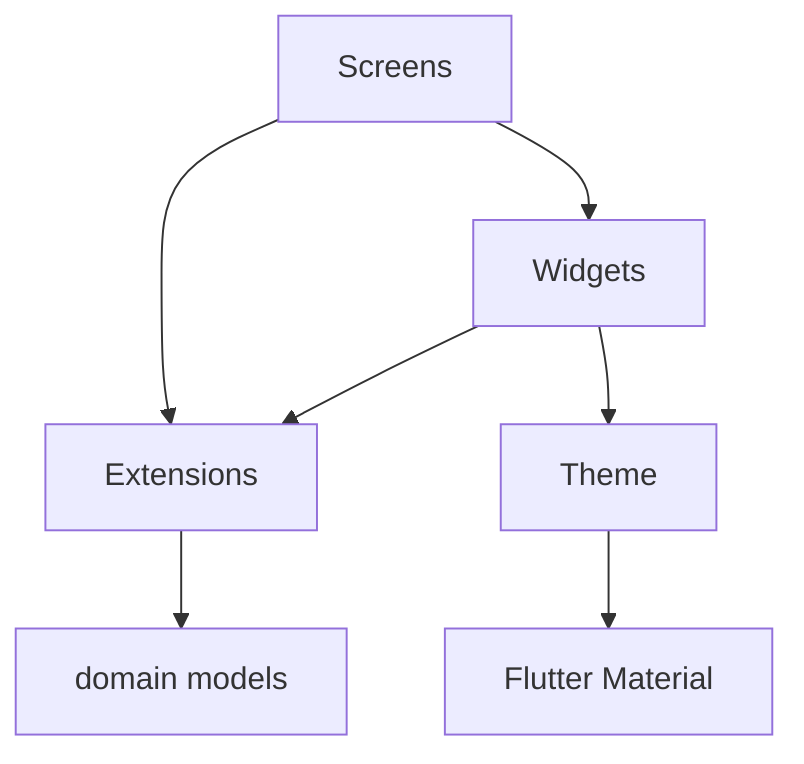

# Presentation Layer

`lib/presentation/` — Flutter UI layer. Depends on the domain layer for models and logic, never the reverse.

## Structure

| Submodule | Purpose |
|-----------|---------|
| [extensions/](extensions/) | Convert domain enums to display values (names, icons, colors) |
| [screens/](screens/) | Full-page views (game, menus) |
| [theme/](theme/) | Centralized design system (colors, typography, buttons) |
| [widgets/](widgets/) | Reusable UI components organized by domain |

## Dependency Flow

## How It Works

The app starts at `MainMenuScreen`, which navigates to either `NewGameScreen` or `LoadGameScreen`. Both lead to `GameScreen`, the main gameplay view.

`GameScreen` holds a `Game` instance and a `GameRepository`. It renders:
- A `ResourceBar` at the top (always visible)
- A tabbed content area (buildings, map, army, tech)
- A `GameBottomBar` for tab navigation and turn advancement

All state changes go through domain actions (`ActionExecutor`) and turn resolution (`TurnResolver`), then call `setState` to rebuild the UI.

## Conventions

- All extensions use `switch` expressions on domain enums
- UI text is in French (game locale)
- Theme is always accessed via `AbyssTheme` — never hardcode colors or styles
- Widget files target < 150 lines each
