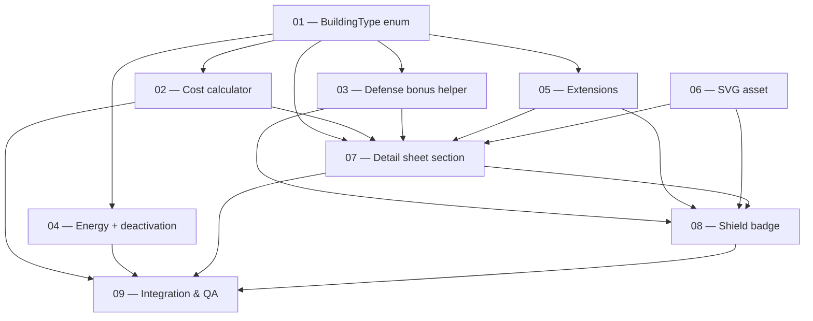

# Coral Citadel — Task Dependencies

## Dependency graph

## Per-task dependencies

| Task | Hard deps | Soft deps / notes |
|------|-----------|-------------------|
| **01 — BuildingType enum** | — | Foundation: every subsequent task fails to compile without this. |
| **02 — Cost calculator**   | 01 | None. Adds pearl support to `BuildingCostCalculator.upgradeCost`. |
| **03 — Defense bonus helper** | 01 | None. Pure helper. |
| **04 — Energy + deactivation** | 01 | None. Touches `consumption_calculator.dart` and `building_deactivator.dart`. |
| **05 — Extensions**         | 01 | 06 (soft): runtime asset failure if SVG is missing when UI renders. |
| **06 — SVG asset**          | — (enum not needed for authoring) | 05 (soft): iconPath must match. |
| **07 — Detail sheet section** | 01, 02, 03 | 05, 06 (soft): sheet opens without them but looks broken. |
| **08 — Shield badge**       | 01, 03, 05 | 07: same file (`building_detail_sheet.dart`) — land 07 first to avoid merge conflicts. |
| **09 — Integration & QA**   | 01–08 | Final seal. Must not land until all upstream tasks pass locally. |

## Recommended landing order

Strict sequential: **01 → 02 → 03 → 04 → 05 → 06 → 07 → 08 → 09**.

### Parallelization opportunities

If multiple developers work on this:

- After 01 merges, these tasks are independent and can run in parallel:
  - **02** (cost calculator)
  - **03** (defense bonus helper)
  - **04** (energy / deactivation)
  - **05** (extensions)
  - **06** (SVG asset — actually independent from 01 too, since authoring a file does not require code compilation)

- Task **07** requires 02 + 03 + 05 + 06 to be in place (it uses all of them together), but a developer can start it locally on top of a local stack while waiting for upstream to merge.

- Task **08** must land **after** 07 because both touch `building_detail_sheet.dart` and the conditional rendering structure assumes the Citadel info section is already present.

- Task **09** is the gate: it must be the last commit.

## Files touched — quick reference matrix

| File | 01 | 02 | 03 | 04 | 05 | 06 | 07 | 08 | 09 |
|------|----|----|----|----|----|----|----|----|----|
| `lib/domain/building/building_type.dart` | ✓ |  |  |  |  |  |  |  |  |
| `lib/domain/building/building_type.g.dart` | ✓ |  |  |  |  |  |  |  |  |
| `lib/domain/game/player_defaults.dart` | ✓ |  |  |  |  |  |  |  |  |
| `lib/domain/building/building_cost_calculator.dart` |  | ✓ |  |  |  |  |  |  |  |
| `lib/domain/building/coral_citadel_defense_bonus.dart` |  |  | ✓ |  |  |  |  |  |  |
| `lib/domain/resource/consumption_calculator.dart` |  |  |  | ✓ |  |  |  |  |  |
| `lib/domain/building/building_deactivator.dart` |  |  |  | ✓ |  |  |  |  |  |
| `lib/presentation/extensions/building_type_extensions.dart` |  |  |  |  | ✓ |  |  |  |  |
| `assets/icons/buildings/coral_citadel.svg` |  |  |  |  |  | ✓ |  |  |  |
| `lib/presentation/widgets/building/coral_citadel_info_section.dart` |  |  |  |  |  |  | ✓ |  |  |
| `lib/presentation/widgets/building/building_detail_sheet.dart` |  |  |  |  |  |  | ✓ | ✓ |  |
| `lib/presentation/widgets/building/base_shield_badge.dart` |  |  |  |  |  |  |  | ✓ |  |
| `lib/presentation/widgets/unit/army_list_view.dart` |  |  |  |  |  |  |  | ✓ |  |
| `lib/presentation/screens/game/game_screen.dart` |  |  |  |  |  |  |  | ✓ |  |
| `specs/architecture/domain/building/README.md` |  |  |  | ✓ |  |  |  |  | ✓ |
| `test/...` (various new & extended) | ✓ | ✓ | ✓ | ✓ | ✓ |  | ✓ | ✓ | ✓ |

## External dependencies

- `hive`, `hive_flutter`, `hive_generator`, `build_runner` — already present.
- `flutter_svg` — already present; needed for task 06 consumption.
- No new packages introduced by this feature.
